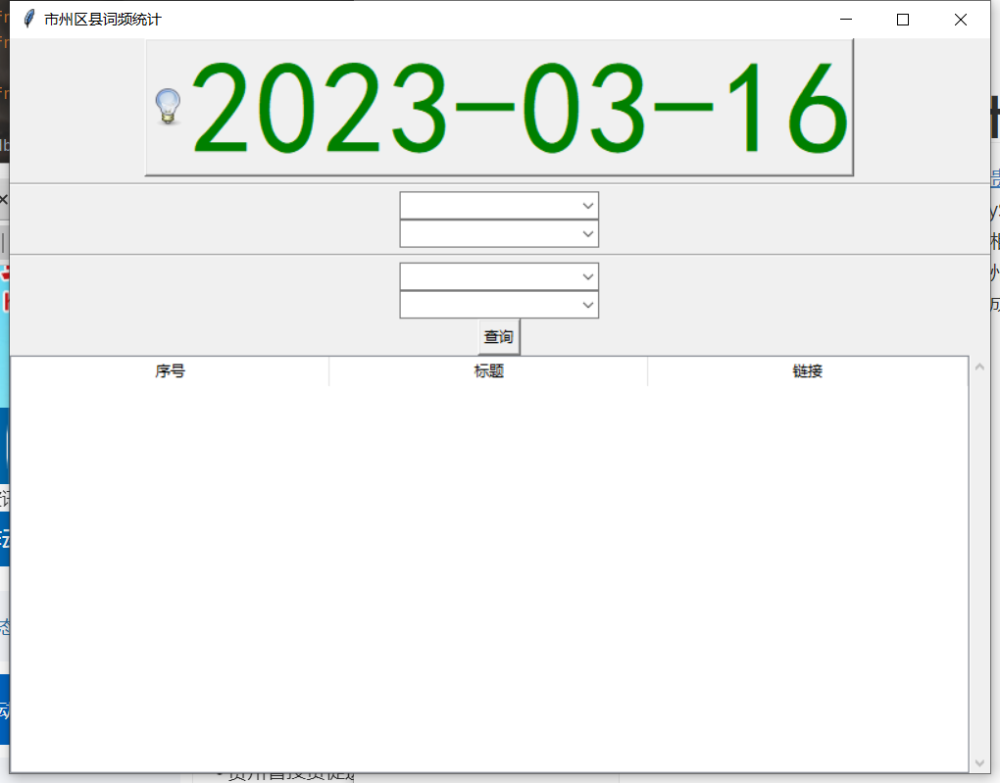
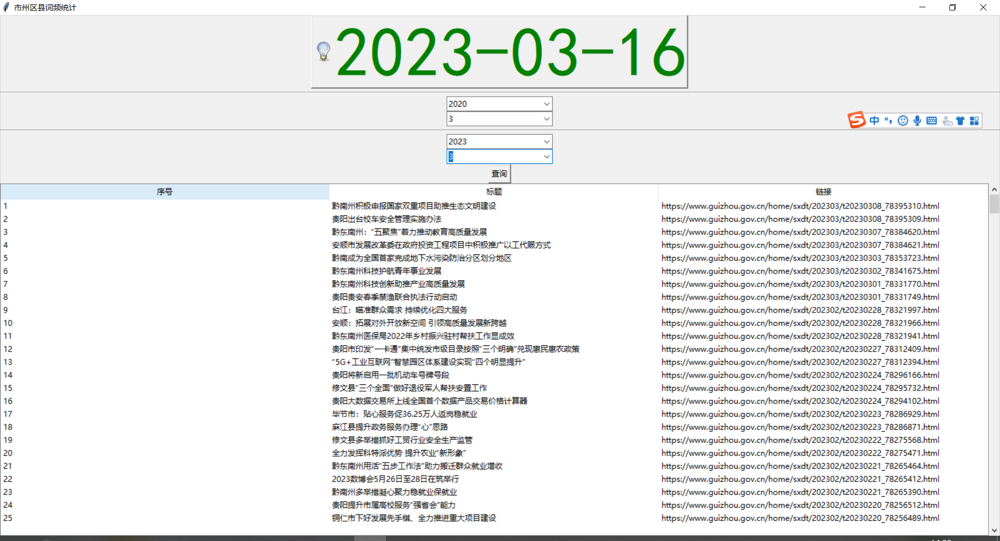

# 市州区县词频统计

本项目从[贵州省人民政府市县动态](https://www.guizhou.gov.cn/home/sxdt)以及[贵州省投资促进局地方动态](http://invest.guizhou.gov.cn/dtzx/gzdt/dfdt/)爬取所有地方动态的数据，并将数据保存到MySQL里面。通过tkinter由用户自主选择时间段，程序将从数据库里检索出相应的记录，并返回到前端界面上，还会统计取出来的数据里，哪些市州区县（通过jieba分词）出现的频次比较多，以此为依据用wordcloud生成词云图

1. 运行初始界面：

   

2. 查询近三年的记录：

   

3. 生成的词云图：

   

本项目主要由三部分模块组成：

## 1.spider

在该模块下，主要功能由核心类GovSpider完成，有以下方法：

- get_gov_name：爬取贵州省所有的市州区县
- spider_gov：爬取贵州省人民政府网的地方动态
- spider_invest：爬取贵州省投资促进局的地方动态

同时可以在实例化GovSpider的时候，传入指定的url和xpath规则，调用上述方法依然能爬取到指定的数据

> 除开市州区县的数据外，省政府以及投资促进局的数据都是一个二维列表，每一个元素包含标题，URL链接以及日期

## 2.database

在该模块下，主要功能由核心类useDBStore完成，有以下方法：

- keep_in_mysql：将爬取到的政务数据保存到MySQL里面
- keep_in_mysql2：将爬取到的市州区县数据保存到MySQL
- search_mysql：按照给定的时间字符串，查询出符合要求的政务数据
- location_mysql：从数据库里检索出所有的地区
- jieba_process：通过jieba处理分词
- draw_cloud：根据上述流程处理后，生成对应的词云图

在实例化useDBStore的时候，可以传入自定义的数据库配置信息，并且由于jieba不能区分碧江跟西秀是一个地区名，需要加载一个文本文件表明

## 3.interface

该模块通过tkinter构建一个简易的交互界面，通过与database交互，将满足用户查询条件的数据从数据库检索出来，并渲染到界面上

